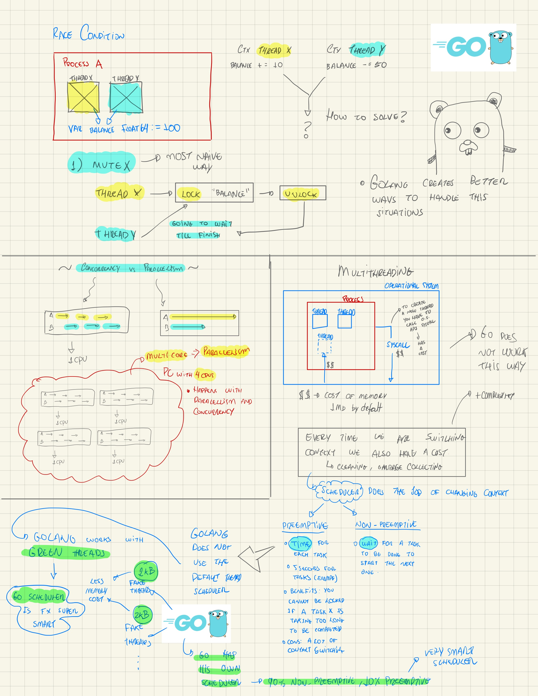

## Useful resources

- https://github.com/tupizz/golang-lab - A collection of Go guided by examples

## Project standards

### How to organize your project on folders
https://github.com/golang-standards/project-layout

- `internal` - where the application code lives, almost like the `src` folder on node.js projects, private folder on our application, heart of the application
- `configs` - where the application configuration lives, all the configuration for bootstraping the application
- `cmd` - where the main application lives, almost like the `bin` folder on node.js projects
- `pkg` - where the reusable code lives, almost like the `lib` folder on node.js projects, public folder on our application, libraries to be shared
- `vendor` - where the dependencies lives, almost like the `node_modules` folder on node.js projects
- `build` - where the build files lives, almost like the `dist` folder on node.js projects
- `test` - where the test files lives, almost like the `test` folder on node.js projects
- `api` - where the api files lives, documentation for the api

## Useful commands

````bash
go env | grep PATH # show go path
go mod init github.com/tupizz/curso-go ## inicia modulo
go mod tidy ## instala dependencias e requirements, remove pacotes que não estamos utilizandos
go mod tidy -e ## install all dependencies except those that are not used and found in the go.mod file
go get golang.org/x/exp/constraints ## instala determinada biblioteca
go run -race main.go # detect race conditions situations on your code while running

# workspaces
go mod edit -replace=github.com/tupizz/curso-go=../curso-go ## substitui o caminho do pacote
go work init ./math ./sistema ## inicia uma nova workspace com os pacotes math e sistema que enxergam um ao outro quando trabalhamos com pacotes locais

# running tests
go test ./... ## run all tests
go test -v ./... ## run all tests with verbose
go test -coverprofile=coverage.out # run all tests and generate coverage file
go tool cover --html=coverage.out # open coverage file in browser to check what is missing
go test -bench=. # run benchmarks in all tests benchmarking created
go test -bench=. -run=^# # run benchmarks in all tests benchmarking created and run only benchmarks that starts with 
go test -bench=. -run=^# -benchmem # run benchmarks in all tests benchmarking created and run only benchmarks that starts with and show memory allocation
go help test # show all test documentation
go test -fuzz=. -fuzztime=10s # run fuzzing tests for 10 seconds
````

### mysql cheat sheet

```bash
# bash 
docker-compose exec mysql bash
mysql -uroot -p goexpert ## senha: root

# sql
drop database goexpert;
create database goexpert;
create table products (id varchar(255), name varchar(255), price decimal(10,2), primary key (id))
```

## Documentations

### Templates
https://pkg.go.dev/html/template

## Concurrency and Parallelism

